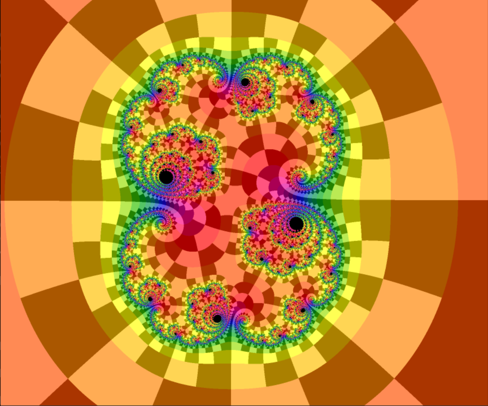
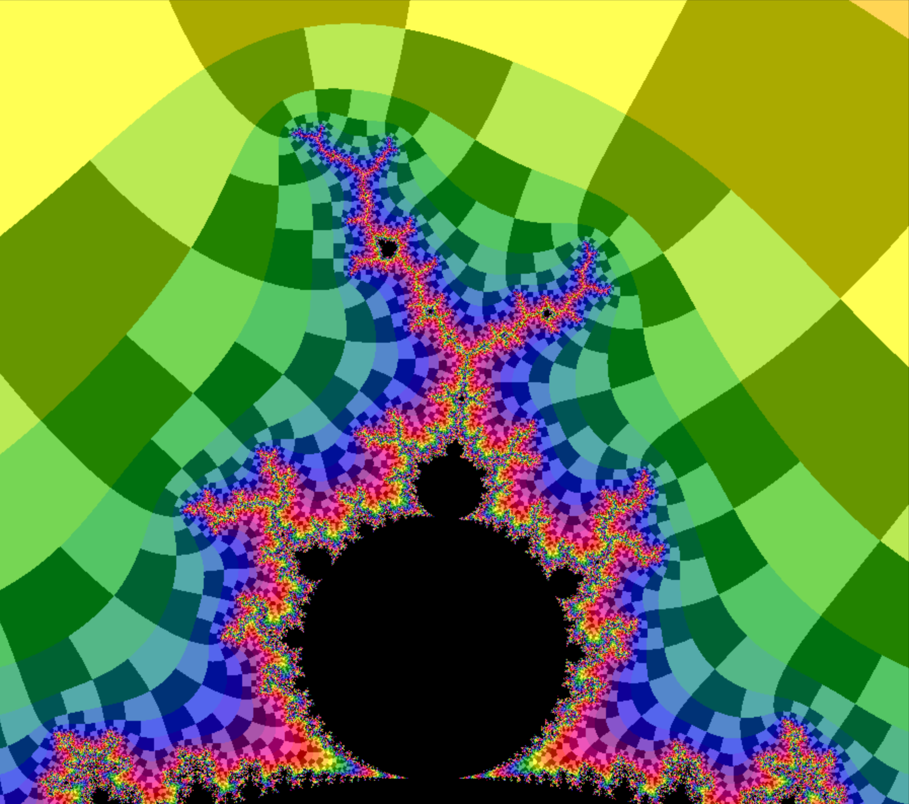

# FractalStream

This is an updated version of FractalStream written in Haskell for cross-platform use. FractalStream is a program which allows you to rapidly explore real and complex dynamical systems.  Behind the scenes, FractalStream is written to take advantage of parallelism in hardware. Iterating a dynamical system usually involves repeating the same algorithm on some array of data. FractalStream makes use of the parallelism in modern hardware (multiple CPUs, multiple cores, vector coprocessors) to rapidly render a depiction of the dynamical system. It is relatively easy to add support for new hardware (for example, a graphics processor) to the FractalStream source code. See the source package for more information.

# Pictures

   

# Features
- Mandelbrot zoom
- with external angles
- Features
- Fast rendering of user-defined dynamical systems
- Simple language for defining dynamical systems
- Multi-processor aware
- History and note-taking features
- Automatic detection and coloring of fixpoints, cycles
- Customizable color schemes, color by fixpoint, external angle, escape speed...
- Cross-platform

# History

FractalStream was originally written in Objective C, and the original version is described [here](https://pi.math.cornell.edu/~noonan/fstream.html). It is designed to mostly work like Karl Papadantonakis' [FractalAsm](https://web.archive.org/web/20170531010725/http://www.math.cornell.edu/~dynamics/FA/).

#  License

FractalStream is released under the [BSD License](https://en.wikipedia.org/wiki/BSD_licenses). 

